# DigitalNotes
Υπηρεσία δημιουργίας ψηφιακών σημειώσεων. Δημιουργήθηκε στα πλάισια εργασίας του προπτυχιακόυ μαθήματος "Πληροφοριακά Συστήματα" του 6ου εξαμήνου του τμήματος Ψηφιακών Συστημάτων του Πανεπιστημίου Πειραιώς

## Contents
* [Το σύστημα](#Το-σύστημα)
* [Η βάση](#Η-βάση)
* [Εγκατάσταση και εκτέλεση](#Εγκατάσταση-και-εκτέλεση)
* [Λειτουργίες Συστήματος](#Λειτουργίες-Συστήματος)
  * [Authentication](#Authentication)
  * [User](#User)
  * [Administrator](#Administrator)

## Το σύστημα
Το πληροφοριακό σύστημα, το οποίο παρέχει την υπηρεσία DigitalNotes, αποτελείται από 2 container.
Το ένα περιέχει τη βάση δεδομένων μας (χρησιμοποιείται MongoDb), ενώ το άλλο περιέχει τα services, για την υλοποίηση των οποίων χρησιμοποιήθηκε η python με την βοήθεια των εργαλείων flask και pymongo για την υλοποίηση της web-εφαρμογής και της επικοινωνίας με τη βάση αντίστοιχα.
Επίσης χρησιμοποιήθηκαν html css και javascript για την δημιουργία των interfaces.

## Η βάση
Χρησιμοποιούνται 2 collections σε μια βάση MongoDb τα οποία έχουν την εξής δομή:
* Το πρώτο collection ονομάζεται users και περιέχει όλες τις πληροφορίες ενός χρήστη.

users:

| username    | password    | email       | fullname    | property    |
| ----------- | ----------- | ----------- | ----------- | ----------- |
| string      | string      | string      | string      | string      |


* To δεύτερο collection ονομάζεται notes και περιέχει όλες τις πληροφορίες μιας σημείωσης.

notes:

| username    | title       | content     | crDate      | kwords      |
| ----------- | ----------- | ----------- | ----------- | ----------- |
| string      | string      | string      | DateTime    | string      |

 *Κατα την εκτέλεση δημιουργείται αυτόματα ο λογαριασμός ενός διαχειριστή με στοιχεία username: admin1, password: admin και email: 'admin@gmail.com'*

## Εγκατάσταση και εκτέλεση

Η εγκατάσταση και εκτέλεση του συστήματος γίνεται σε 2 απλά βήματα *(προϋποθέτει να υπάρχει εγκατεστημένη κάποια έκδοση του docker)*:

1. Clone αυτού του repository στον υπολογιστή.
2. Εκτέλεση της παρακάτω εντολής στο local directory που είναι αποθηκευμένο το repo:

```bash
sudo docker-compose up --build
```
 *Το sudo παραλείπεται για MacOs ή Windows*

## Λειτουργίες Συστήματος

##  Authentication

### Sign-In page
Η σελίδα σύνδεσης είναι η πρώτη σελίδα που θα εμφανιστεί σε κάθε χρήστη μόλις συνδεθεί στη διεύθυνση '0.0.0.0:5000'.
Σε αυτή τη σελίδα μπορεί ο χρήστης να εισάγει τα στοιχεία του λογαριασμού του και αν αυτά επαληθευτούν από το σύστημα να συνδεθεί σε αυτόν.
Σε περίπτωση που κάποιος νέος χρήστης δεν έχει ακόμα λογαριασμό του δίνεται η δυνατότητα μετάβασης στη σελίδα δημιουργίας λογαριασμού.

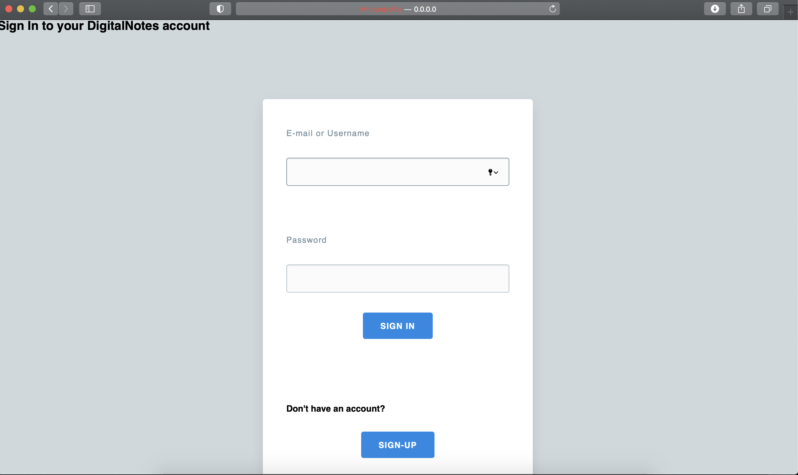

### Sign-Up page
Στη σελίδα εγγραφής ο χρήστης μπορεί να δημιουργήσει έναν λογαριασμό με τα στοιχεία του οποίου θα μπορεί να εισέρχεται στην υπηρεσία DigitalNotes.
Ένας νέος χρήστης δε μπορεί να δημιουργήσει λογαριασμό με username ή email που ήδη χρησιμοποιείται.

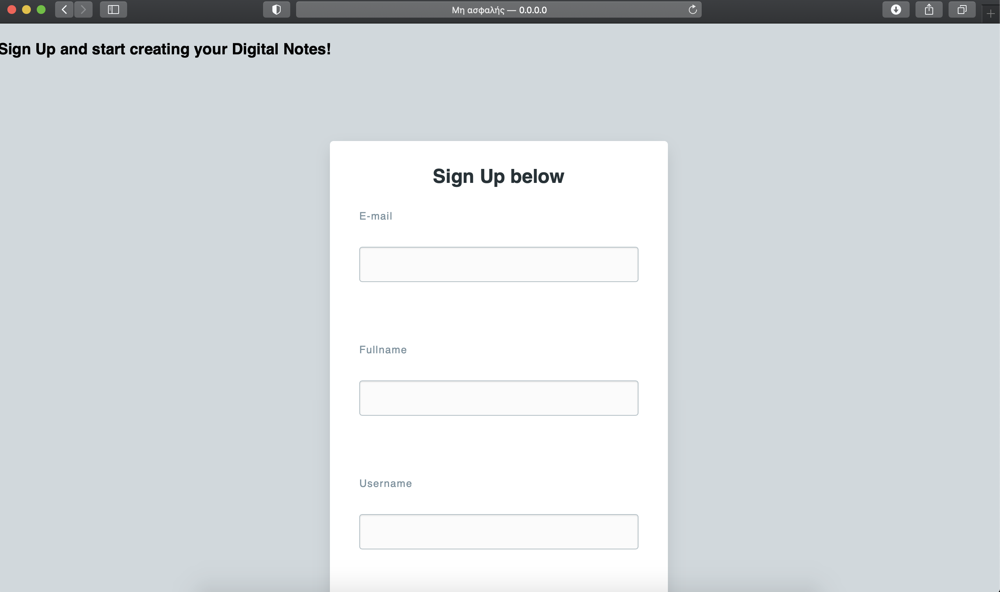
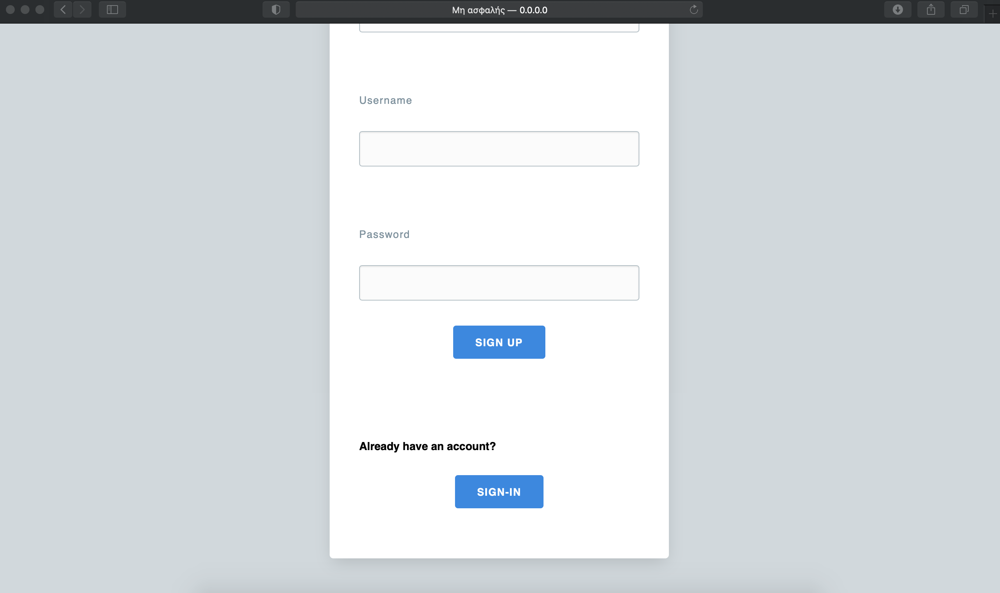

## User
### Εμφάνιση σημειώσεων
Ένας εγγεγραμμένος χρήστης αφού εισάγει επιτυχώς τα στοιχεία του και εισέλθει στην υπηρεσία θα μεταφερθεί αυτόματα στην κύρια σελίδα στην οποία μπορεί να δει όλες τις υπάρχουσες σημειώσεις του, έχοντας την επιλογή να δει πρώτα τις παλαιότερες ή τις νεότερες σημειώσεις του *(Δουλεύει μόνο με ημερομηνία)*.
Από εκεί μέσω των κουμπιών τα οποία βρίσκονται στο πάνω μέρος τις οθόνης μπορεί να περιηγηθεί στις διάφορες λειτουργίες που παρέχει η υπηρεσία.

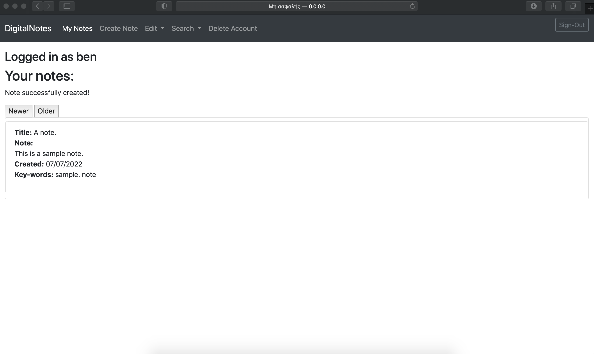

### Δημιουργία σημείωσης
Σε αυτή τη σελίδα ο χρήστης μπορεί να δημιουργήσει μια σημείωση εισάγοντας τίτλο, περιεχόμενο και λέξεις κλειδιά.

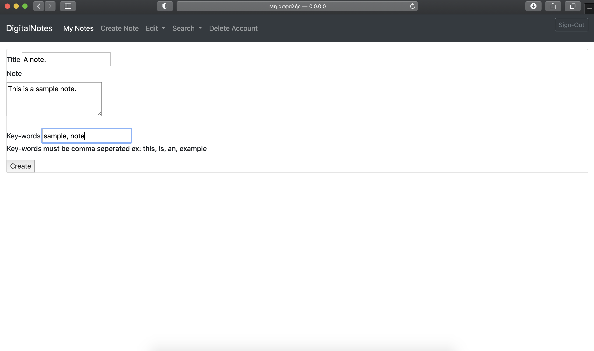

### Επεξεργασία σημείωσης
Σε αυτή τη σελίδα ο χρήστης μπορεί να επεξεργαστεί μια σημείωση αλλάζοντας τον τίτλο, το περιεχόμενο και τις λέξεις κλειδιά.
Ο χρήστης πρέπει να δηλώσει τον τίτλο της σημείωσης που θέλει να επεξεργαστεί.
*Αν ο χρήστης δεν επιθυμεί να αλλάξει κάποιο από τα στοιχεία της σημείωσης πρέπει να το ξαναγράψει.*
*Στο κάτω μέρος της οθόνης εμφανίζονται οι σημειώσεις του χρήστη ώστε να μπορεί να βρει τον τίτλο που επιθυμεί αλλά και να δει το περιεχόμενο και τις λέξεις κλειδιά της σημείωσης.*
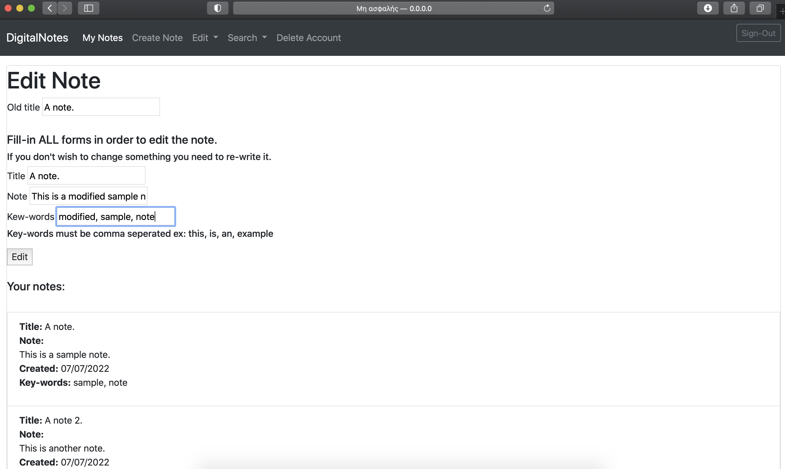

### Διαγραφή σημείωσης
Ο χρήστης μπορεί να διαγράψει μια σημείωση πληκτρολογώντας τον τίτλο της στο αντίστοιχο πεδίο.
*Στο κάτω μέρος της οθόνης εμφανίζονται οι σημειώσεις του χρήστη ώστε να μπορεί να βρει τον τίτλο που επιθυμεί αλλά και να δει το περιεχόμενο και τις λέξεις κλειδιά της σημείωσης.*

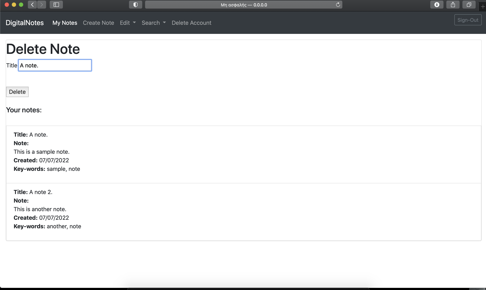

### Αναζήτηση σημείωσης μέσω τίτλου
Ο χρήστης μπορεί να αναζητήσει μια σημείωση βάση του τίτλου της, πληκτρολογώντας τον τίτλο της ή μέρος αυτού.

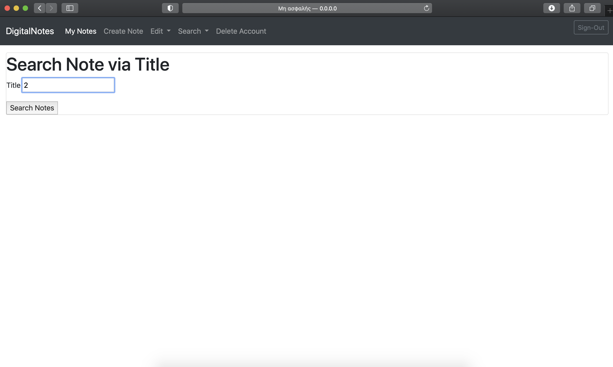
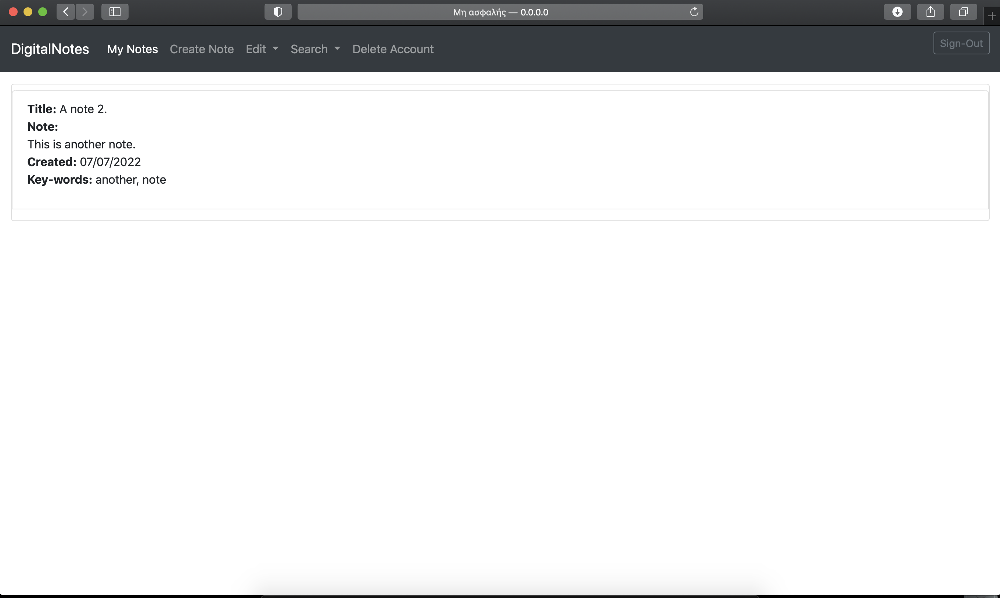

### Αναζήτηση σημείωσης μέσω λέξης-κλειδιού
Ο χρήστης μπορεί να αναζητήσει μια σημείωση βάση μιας λέξης κλειδιού πληκτρολογώντας την λέξης ή μέρος αυτής.
Η αναζήτηση γίνεται βάσει *ΜΙΑΣ* λέξης, αν τοποθετηθούν περισσότερες λέξεις διαχωρισμένες με κόμμα δε θα γίνει επιτυχής αναζήτηση!

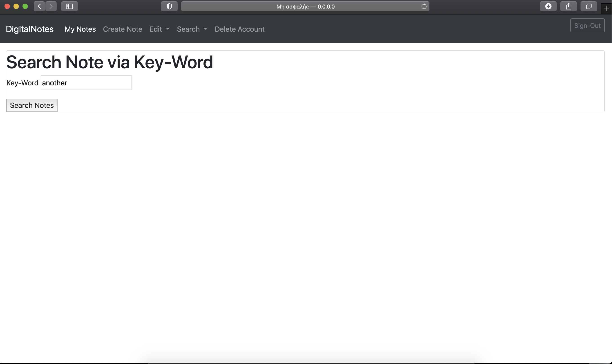
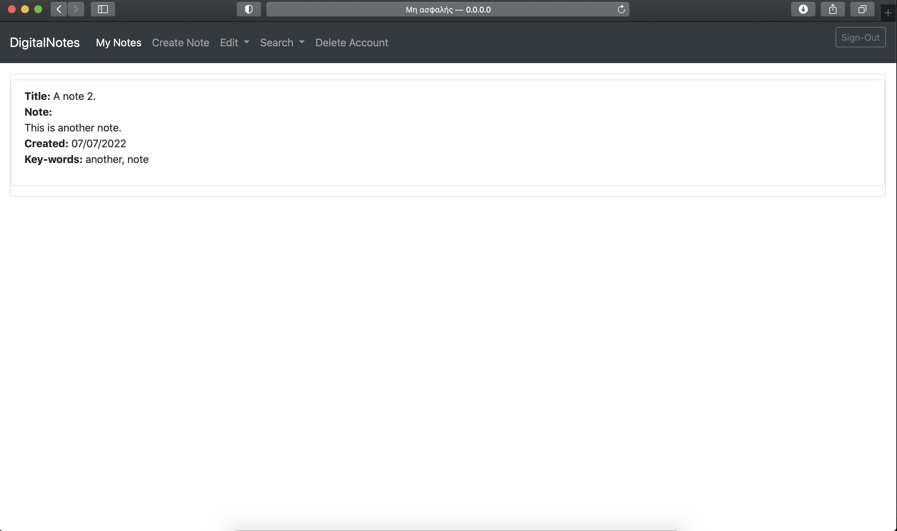

### Διαγραφή λογαριασμού
Ο χρήστης μπορεί αν το επιθυμεί να διαγράψει το λογαριασμό του σβήνοντας μαζί οποιοδήποτε σημείωμα σχετίζεται με αυτόν.
Έπειτα ο χρήστης θα μεταφέρεται στη σελίδα εγγραφής σε περίπτωση που θέλει να δημιουργήσει νέο λογαριασμό.

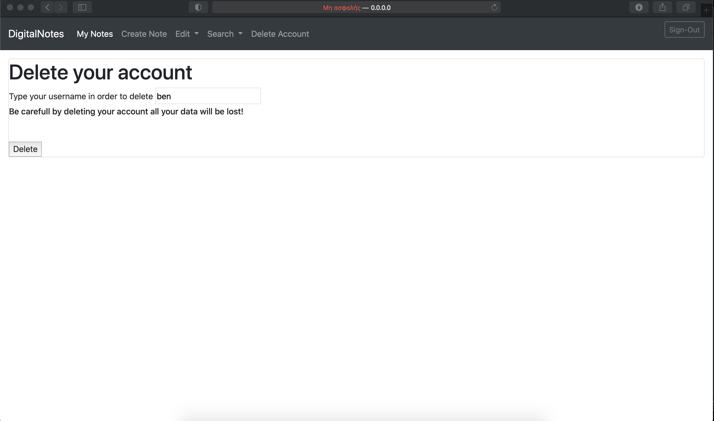

## Administrator

### Home page
Αν κάποιος χρήστης εισέλθει στο σύστημα με λογαριασμό διαχειριστή μεταφέρεται σε μια σελίδα καλωσορίσματος.
Από εκεί μέσω των κουμπιών τα οποία βρίσκονται στο πάνω μέρος τις οθόνης μπορεί να περιηγηθεί στις διάφορες λειτουργίες που παρέχει η υπηρεσία.

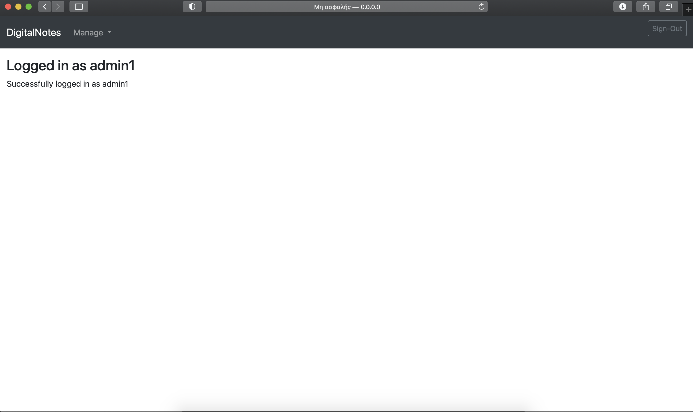


### Δημιουργία διαχειριστή
Ένας διαχειριστής έχει τη δυνατότητα να δημιουργεί νέους λογαριασμούς διαχειριστών εισάγοντας username, fullname και email για αυτούς.


Για κάθε νέο λογαριασμό διαχειριστή εισάγεται αυτόματα ένας κωδικός μιας χρήσης ο οποίος πάντα έχει την τιμή 'otpword'.
Το σύστημα ζητά από τον χρήστη να αλλάξει τον κωδικό αυτό κατά την πρώτη του σύνδεση στο σύστημα με τον λογαριασμό.

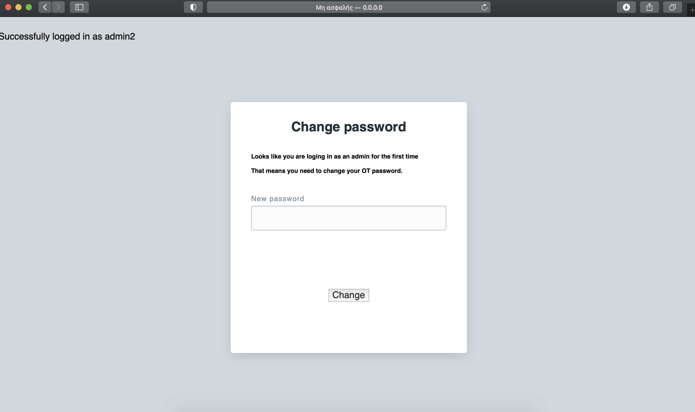

### Διαγραφή χρήστη
Ένας διαχειριστής έχει τη δυνατότητα να διαγράφει τον λογαριασμό κάποιου χρήστη από το σύστημα, πληκτρολογώντας το όνομα χρήστη του.

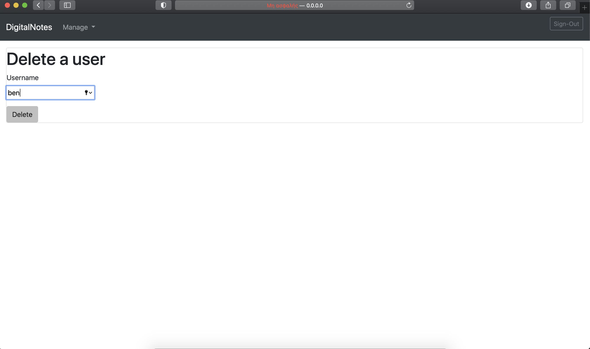
